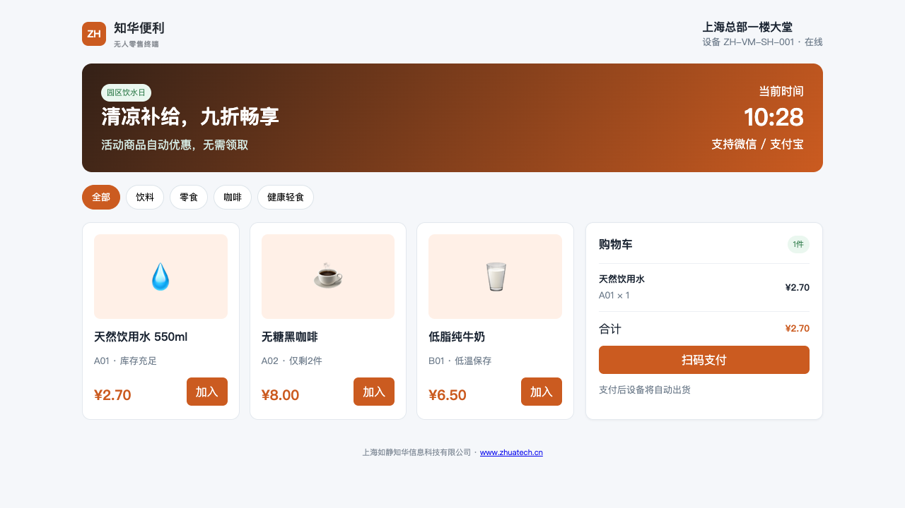
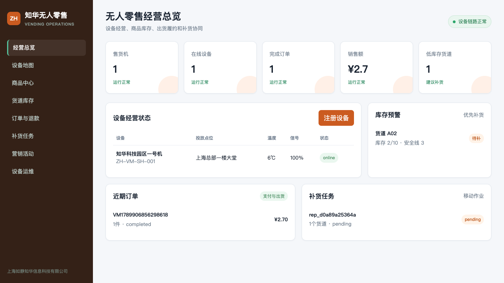

# 知华无人零售与智能售货机平台（社区源码版）

为智能售货机、无人货柜和园区零售点提供商品、货道、库存、订单、支付、出货、退款、补货、促销和设备运维的一体化系统。

项目由[知华科技（上海如静知华信息科技有限公司）](https://www.zhuatech.cn/)维护。商业授权、支付平台接入、智能售货机硬件适配或深度定制，请添加微信 `zhuatech` / `zhuatech2`。

## 产品预览

| 自助售货终端 | 运营管理后台 |
| --- | --- |
|  |  |

## 真正实现的零售闭环

```text
商品与货道 → 库存可售量 → 下单预占 → 支付确认 → 设备出货
                                       ├─ 成功：扣减库存并完成订单
                                       └─ 失败：释放库存、申请退款、自动开维修单
```

### 商品与定价

SKU和条码唯一、售价不能低于成本；每台机器可设置自己的货道价格。限时促销支持折扣和直减，并在订单创建时计算、固化优惠。

### 库存与补货

库存区分实际数量和订单预占数量，防止并发超卖。低于安全库存的货道可以自动生成补货任务，补货完成时会校验货道容量。

### 订单与履约

订单支持幂等创建、5分钟支付有效期、支付渠道校验和交易流水。设备逐货道上报出货结果；部分失败仅退款失败商品金额。

### 设备和运维

售货机心跳记录网络、温度、固件和在线状态；出货失败自动生成高优先级维修工单，全部故障关闭后恢复设备经营状态。

## 功能覆盖

| 中心 | 功能 |
| --- | --- |
| 商品中心 | SKU、条码、类目、成本、售价、保质期 |
| 设备中心 | 点位、机型、令牌、支付渠道、固件、心跳 |
| 货道库存 | 容量、在库、预占、安全库存、单机价格 |
| 订单中心 | 幂等下单、优惠、支付、出货、退款 |
| 补货中心 | 缺口建议、任务、责任人、实际补货 |
| 营销中心 | 限时折扣、直减、适用商品范围 |
| 运维中心 | 故障码、风险、工单、关闭和设备恢复 |

## 启动与验证

```bash
cp .env.example .env
npm test
VENDING_API_KEY=zhuatech-demo-key npm start
```

- 自助售货终端：`http://127.0.0.1:18105/`
- 运营管理后台：`http://127.0.0.1:18105/console`
- Docker：`docker compose up --build`

自动化用例验证库存预占、促销价格、幂等订单、成功出货、失败退款、维修工单和补货容量。默认 JSON 快照便于演示，MySQL 8 数据模型见 `database/schema.sql`，接口见 [API](docs/API.md)。

## 声明

本项目仅限个人学习、研究和交流，不得商用。企业经营、设备预装、SaaS、项目交付、支付接入、收费下载或其他商业用途必须获得上海如静知华信息科技有限公司书面授权。本项目是 source-available 社区源码，不属于 OSI 认可的开源软件。

| 微信号 `zhuatech` | 微信号 `zhuatech2` |
| --- | --- |
|  |  |

Copyright © 上海如静知华信息科技有限公司。
